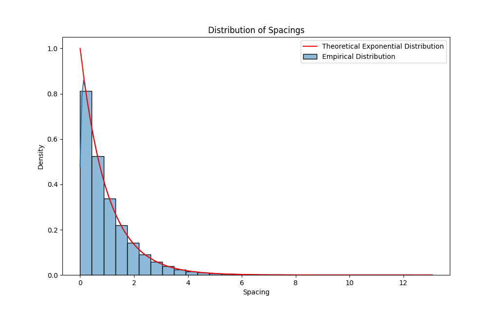

# Zypper random generator

By [Zypper](https://www.zypper.app) gebruiken we de [`numpy`](https://numpy.org/doc/stable/reference/random/generator.html) random generator om de start euro te bepalen. De random generator algoritme die wordt gebruikt is [`PCG-64`](https://numpy.org/doc/stable/reference/random/bit_generators/pcg64.html#numpy.random.PCG64) and is een modern en statistisch bewezen algoritme voor het genereren van random getallen.

In deze repo bewijzen we door middel van de [`Birthday Spacing Test`](https://en.wikipedia.org/wiki/Diehard_tests) de randomness van `numpy` random generator die wordt gebruikt binnen Zypper.


<br><br>

# Quickstart (linux / MacOS)

1. Maak een virtual env aan:

```
python -m venv venv && source venv/bin/activate
```

2. Installeer de nodige packages

```
pip install -r requirements.txt
```

3. Run de test

```python
python main.py
```
