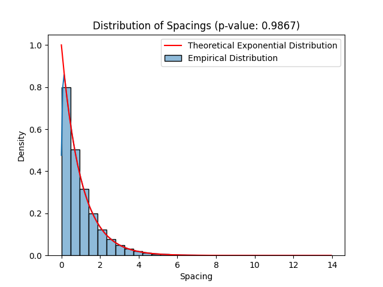

Bewijs random generator van Zypper
===

> repository met bewijslast voor de randomness van de numpy generator in Zypper. 

# Inhoudsopgave
- [Introductie](#introductie)
    - [De Kolmogorov-Smirnov Test](#1-de-kolmogorov-smirnov-test)
        - [Uitvoering](#uitvoering)
        - [Interpretatie van resultaten](#interpretatie-van-resultaten)
    - [De Birthday Spacing Test](#2-de-birthday-spacing-test)
        - [kansverdelingen tabel](#kansverdelingen)
        - [Uitvoering](#uitvoering-1)
        - [Interpretatie van resultaten](#interpretatie-van-resultaten-1)
- [Techniek: hoe kan je dit project gebruiken?](#techniek--hoe-kan-je-dit-project-gebruiken)
    - [Quickstart (linux / MacOS)](#quickstart--linux--macos-)
## Introductie 

Bij [Zypper](https://www.zypper.app) gebruiken we de [`numpy`](https://numpy.org/doc/stable/reference/random/generator.html) random generator om de start euro te bepalen. De random generator algoritme die wordt gebruikt is [`PCG-64`](https://numpy.org/doc/stable/reference/random/bit_generators/pcg64.html#numpy.random.PCG64) en is een modern en statistisch bewezen algoritme voor het genereren van random getallen.

In deze repository bewijzen we de randomness van de `numpy` random generator die wordt gebruikt binnen Zypper door 2 tests uit te voeren:
1. De Kolmogorov-Smirnov Test  
2. De [`Birthday Spacing Test`](https://en.wikipedia.org/wiki/Diehard_tests) 


##  1. De Kolmogorov-Smirnov Test

Het doel van deze test is om de willekeurigheid van de random number generator van `numpy` te valideren. 
In deze test onderzoeken we de afstanden tussen willekeurig gegenereerde getallen en 
bepalen we of deze afstanden een exponentiële verdeling volgen, zoals verwacht van een willekeurig proces.

- **Inputs**:
  - `n_numbers`: Aantal te genereren willekeurige getallen
  - `range_interval`: Bereik waarbinnen de willekeurige getallen worden gegenereerd

- **output**:
  - Genereert willekeurige getallen uniform verdeeld binnen het gegeven bereik.
  - Berekent de afstanden tussen deze getallen door ze te sorteren en de verschillen te berekenen.
  - Fit de waargenomen afstanden aan een exponentiële verdeling om de distributieparameters te verkrijgen.
  - Vergelijkt de waargenomen afstanden met een theoretische exponentiële verdeling met behulp van de Kolmogorov-Smirnov (KS) test.
  - Geeft de KS-statistiek en p-waarde weer en neemt een beslissing op basis van de p-waarde.


<br><br>


### Uitvoering

Bij uitvoering toont het script het volgende:

1. Een plot die de empirische verdeling van afstanden vergelijkt met de theoretische exponentiële verdeling.
2. Toont de Kolmogorov-Smirnov statistiek en p-waarde.
3. Maakt een beslissing over of de willekeurige getallen gegenereerd door `numpy` als echt willekeurig kunnen worden beschouwd op basis van de p-waarde.

### Interpretatie van resultaten

- **Als de p-waarde groter is dan 0,05**: Dit suggereert dat de afstanden tussen willekeurige getallen gegenereerd door `numpy` uniform zijn verdeeld, wat impliceert dat de random generator in `numpy` werkt zoals verwacht.
  
- **Als de p-waarde kleiner is dan of gelijk aan 0,05**: De afstanden lijken niet uniform verdeeld te zijn, wat suggereert dat de random generator mogelijk niet echt willekeurig is.


## 2. De Birthday Spacing Test

Het doel van deze test is om de willekeurigheid van de random number generator van `numpy` te valideren. De Birthday Spacing Test is gebaseerd op het verjaardagsparadox, waarbij de kans dat twee of meer personen in een willekeurige groep dezelfde verjaardag hebben, wordt onderzocht.
De kans dat er overlap is, wordt in de volgende tabel aangegeven per groepsgrootte. Als er 23 mensen in een kamer zijn, is de kans op overlap 50.7%.


### kansverdelingen

| n     | p(n)                                    |
|-------|----------------------------------------|
| 1     | 0.0%                                   |
| 5     | 2.7%                                   |
| 10    | 11.7%                                  |
| 20    | 41.1%                                  |
| 23    | 50.7%                                  |
| 30    | 70.6%                                  |
| 40    | 89.1%                                  |
| 50    | 97.0%                                  |
| 60    | 99.4%                                  |
| 70    | 99.9%                                  |
| 75    | 99.97%                                 |
| 100   | 99.99997%                              |


- **Inputs**:
  - `n_numbers`: Aantal verjaardagen dat gegenereerd moet worden.
  - `n_perform_test`: Aantal keren dat de test moet worden uitgevoerd (default = 100.000 keer) .

- **Output**:
  - Genereert een lijst van willekeurige getallen die de verjaardagen vertegenwoordigen (tussen 1 en 365).
  - Controleert of er overlappingen zijn in de verjaardagen (meer dan één persoon met dezelfde verjaardag).
  - Bereken het percentage van overlappingen na vele herhalingen van de test.
  - Vergelijkt het berekende percentage van overlappingen met een verwachte verdeling.


### Uitvoering

Bij uitvoering toont het script het volgende:

1. Of de test is geslaagd of niet voor een specifiek aantal personen, gebaseerd op de verwachte en berekende percentages van overlappingen.
2. Een  plot die de verwachte verdeling vergelijkt met de berekende verdeling.

### Interpretatie van resultaten

- **Als het verschil tussen het berekende en het verwachte percentage kleiner is dan 1**: De test is geslaagd en dit suggereert dat de getallen gegenereerd door `numpy` willekeurig zijn en de verwachte verdeling volgen.
  
- **Als het verschil groter is dan 1**: De test is niet geslaagd, wat suggereert dat er mogelijk een probleem is met de willekeurigheid van de gegenereerde getallen.


---
## Techniek: hoe kan je dit project gebruiken? 
### Quickstart (linux / MacOS)

1. Maak een virtual env aan:

```
python -m venv venv && source venv/bin/activate
```

2. Installeer de nodige packages

```
pip install -r requirements.txt
```

3. Run de test

```python
python main.py
```
